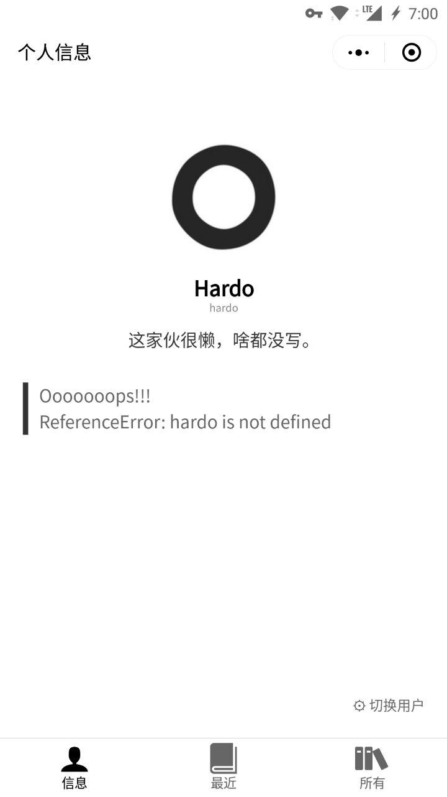
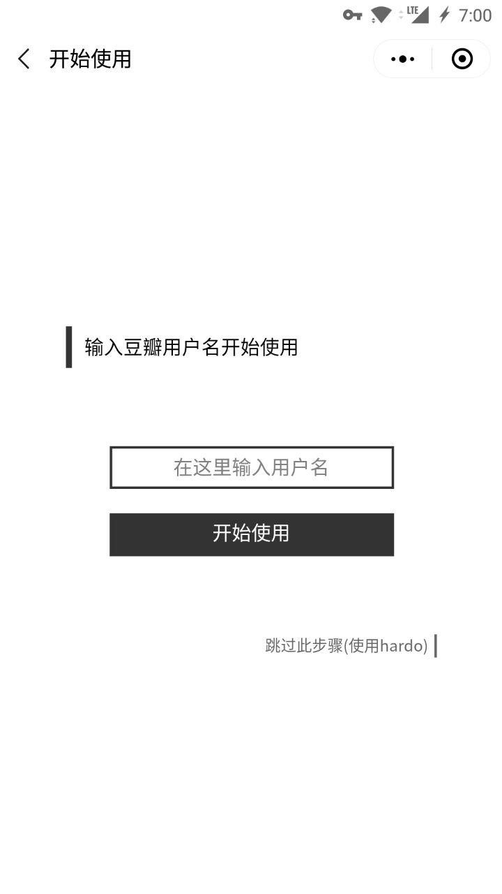

## BooksMP (逗伴我读)

一个微信小程序项目，用于展示豆瓣读书用户最近在读的书目

## 怎么使用

微信搜索 `逗伴我读` 打开搜索到的小程序，或扫描下方二维码进入：

## 可以用来干什么

- 方便地在手机上随时随地查看自己最近想要看的书
- 追踪心爱的他（她）最近在豆瓣上的读书记录

## 界面截图

界面 | 界面截图 
:----:|:--------:
主界面 |  
历史界面 | 
个人信息 | 
初始化(用户切换) | 
详情界面 |  

## 问题反馈

- 任何与程序相关的 建议、bug报告 等请提交到 [Github issue](https://github.com/hardo/BooksMP/issues) 。

## 请我喝瓶冰阔啰？

(虽然知道不会有人请，但还是放在这试试:P)

